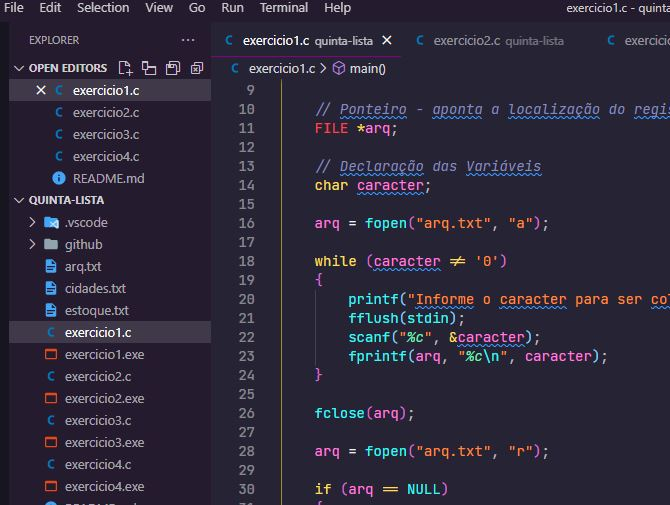

<h1 align="center">
    
</h1>

    <h3> 🔵 Quinta Lista 🔵 </h3>
    
     
    

## Lista 5

Lista de exercícios para praticar algoritmo estruturado e lógica de programação.

## Questões

1.	Escreva um programa que: 
•	Crie/abra um arquivo texto de nome “arq.txt”
•	Permita que o usuário grave diversos caracteres nesse arquivo, até que o usuário entre com o caractere ‘0’
•	Feche o arquivo 

2.	Faça um programa que abra e leia o arquivo do exercício 1, caractere por caractere, e escreva na tela todos os caracteres armazenados.

3.	Faça um programa que receba o nome de um arquivo de entrada. O arquivo de entrada contem em cada linha o nome de uma cidade (ocupando 40 caracteres). O programa devera ler o arquivo de entrada e mostrar todas as cidades.

4.	Faça um programa que leia um arquivo contendo o nome e a situação de estoque S para “ Sim, em estoque” o N para “Sem estoque”. O programa procurará o produto escolhido pelo usuário e dirá se há ou não estoque! Mostrar os nomes dos produtos para que o usuário faça sua escolha!

## 🛠️ Linguagem

💻 C

### ☑️ Código:

## 🌟 CEFET / RJ

Essa lista foi passada no meu curso de Sistemas de Informação realizado no CEFET.

